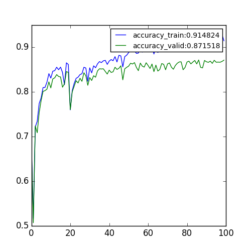
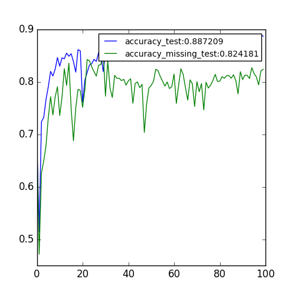
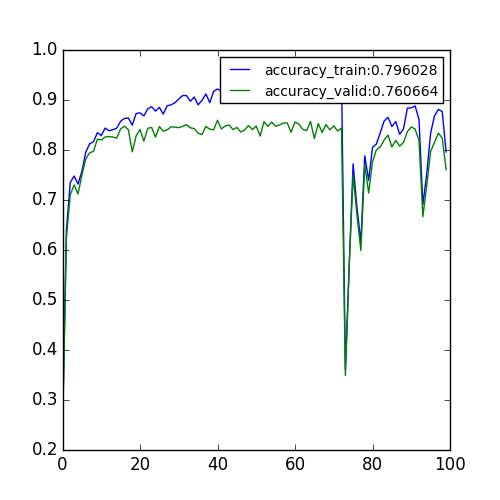
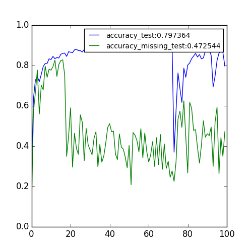

# Record for Classification Project

## 1. Analysis of Training Classification Model with Emotion Embedding

### Phenomenon: The trainig process is very unstable.

### 1. Expr1: RNN classifier with a 3-dimensional embedding of emotion.
missing pairs:{"Simple Walk","Panic Fear"},{"Sitting Down","Sadness"},{"Move Books","Joy"} 
Dataset: Emilya Dataset 
Training Set: 60% of Emilya Dataset and remove the missing paris. 
Validation Set: 20% Emilya Dataset 
Test Set: 20% of Emilya Dataset, missing paris are removed 
missing_test: The missing pairs removed during constructing Test Set 

#### a. accuracy curve(x-axis: epochs, y-axis: accuracy(range: 0 - 1.))

#### b. accuracy on test set and missing-pairs set.

### 2. Expr2:RNN classifier without any emotion input
The remaining setting is same with Expr1.  
It's very easy to reach a high accuracy for both training set , validation set, test set ,missing pairs set.

See this figure:

#### a. accuracy curve(x-axis: epochs, y-axis: accuracy(range: 0 - 1.))

#### b. accuracy on test set and missing-pairs set.

### explanation:
At the early stage of training process, the emotion embeddings have not been learned well. Some very different emotions may be close with each other in the embedding space, while the embeedings of some emotions which are similar essentially may be far away with each other. This makes the classification model tends to overfit for each emotion. So in the early stage, when update the the embedding of emotions, the beheviour of the model might change dramatically. Thus, the instantaneous performance of classification can decrease dramatically as seen in the above image. 

For addressing this problem, I am thinking about some methods. One of possible way is like this: 
Assume we have a training set $X={X_1,X_2}$, where $X_1$ is the subset where all the sequences are labeled by emotions, while $X_2$ is the one where the sequences are not labeled by emotions.
Before each epoch of training process, we randomly assign emotion labels to $X_2$ and then use $X$ train the models. 

*******************************************************************

# 2. 18 May,2017 
#### After multiple experiments, I found that 'Adam' optimiser makes the learning process of RNN classifier more stable than other optimisers. 

## Expr1: Activity classifier without emotion input
#### Experiment setting: 
hidden\_dim\_list=[100, 20], activation_list=['tanh', 'tanh'],  
max_epoch=50, optimiser='adam', lr=0.005, decay=1e-4, 
# missing pairs:{"Simple Walk","Panic Fear"},{"Sitting Down","Sadness"},{"Move Books","Joy"} 

#### Accuracy curve on training set and validation set:

#### Accuracy curve on test and missing sets.

## Expr2: Activity classifier with emotion embedding
#### Experiment setting:
Embedding Dimension: 3
The remaining hyperparameters are the same with Expr2

Besides,in this experiment,Embedding layer is set as untrainable at the begining of training process. After several epochs, when the accuracy on training set is larger than 85%, the embedding layer is enabled to be trainable. 

In this experiment, from the 16th epoch, the embedding layer is set to be trainable. We can see the accuracy on missing set has a dramatical decrease when the embedding layer is trained. 

#### Accuracy Curve on training and validation sets:

#### Accuracy curve on test and missing sets.:

*******************************************************************

# 3.01 Juin,2017
## Expr(Deleted): activation "relu" doesn't work and will cause sigularity "NAN"
### Experiment setting:

    embd_dim=3, hidden_dim_list=[100, 20,20], 
    activation_list=['relu', 'relu','relu'],
    batch_norm_list=[True,False,False],
    batch_size=300,
    max_epoch=100, optimiser='adam', lr=0.001, decay=0,
    momentum=0.0,nesterov = False,remove_pairs=True,
    rm_activities=['Simple Walk','Sitting Down', 'Move Books'],
    rm_emotions=['Panic Fear','Sadness', 'Joy'],
    constant_initializer=None,constant_value=1.,threshold_embd=None)

## Expr005 (Running): use 'tanh' with batchnormalization
### Path of Experiment: /data1/home/wang.qi/CODE/python/Classification/training/Emilya_Dataset/expr1705/expr005

Setting:

    embd_dim=2, hidden_dim_list=[50, 20,20], 
    activation_list=['tanh', 'tanh','tanh'],
    batch_norm_list=[True,True,False],
    batch_size=300,
    max_epoch=100, optimiser='adam', lr=0.001, decay=0,
    momentum=0.0,nesterov = False,remove_pairs=True,
    rm_activities=['Simple Walk','Sitting Down', 'Move Books'],
    rm_emotions=['Panic Fear','Sadness', 'Joy'],
    constant_initializer=None,constant_value=1.,threshold_embd=None)
 
## Expr006 (Running): use 'tanh' with batchnormalization for all layers
### Path of Experiment:/data1/home/wang.qi/CODE/python/Classification/training/Emilya_Dataset/expr1705/expr006
 
Setting:

    embd_dim=2, hidden_dim_list=[50, 20,20],
    activation_list=['tanh', 'tanh','tanh']
    batch_norm_list=[True,True,True],
    batch_size=300,
    max_epoch=100, optimiser='adam', lr=0.001, decay=0,
    momentum=0.0,nesterov = False,remove_pairs=True,
    rm_activities=['Simple Walk','Sitting Down', 'Move Books'],
    rm_emotions=['Panic Fear','Sadness','Joy'],
    constant_initializer=None,constant_value=1.,threshold_embd=None)

## Expr007(Running): use 'softsign'

 ### Path of Experiment:/data1/home/wang.qi/CODE/python/Classification/training/Emilya_Dataset/expr1705/expr007
 
Setting:

    embd_dim=2, hidden_dim_list=[50, 20,20],
    activation_list=['softsign', 'softsigm','softsign']
    batch_norm_list=[False,False,False],
    batch_size=300,
    max_epoch=100, optimiser='adam', lr=0.001, decay=0,
    momentum=0.0,nesterov = False,remove_pairs=True,
    rm_activities=['Simple Walk','Sitting Down', 'Move Books'],
    rm_emotions=['Panic Fear','Sadness','Joy'],
    constant_initializer=None,constant_value=1.,threshold_embd=None)

## Expr008(Running): use 'softsign'

 ### Path of Experiment:/data1/home/wang.qi/CODE/python/Classification/training/Emilya_Dataset/expr1705/expr008
 
Setting:

    embd_dim=2, hidden_dim_list=[50, 20,20],
    activation_list=['softsign', 'softsigm','softsign']
    batch_norm_list=[True,False,False],
    batch_size=300,
    max_epoch=100, optimiser='adam', lr=0.001, decay=0,
    momentum=0.0,nesterov = False,remove_pairs=True,
    rm_activities=['Simple Walk','Sitting Down', 'Move Books'],
    rm_emotions=['Panic Fear','Sadness','Joy'],
    constant_initializer=None,constant_value=1.,threshold_embd=None)

## Expr009(Running): use 'softsign'

 ### Path of Experiment:/data1/home/wang.qi/CODE/python/Classification/training/Emilya_Dataset/expr1705/expr009
 
Setting:

    embd_dim=2, hidden_dim_list=[50, 20,20],
    activation_list=['softsign', 'softsigm','softsign']
    batch_norm_list=[True,True,True],
    batch_size=300,
    max_epoch=100, optimiser='adam', lr=0.001, decay=0,
    momentum=0.0,nesterov = False,remove_pairs=True,
    rm_activities=['Simple Walk','Sitting Down', 'Move Books'],
    rm_emotions=['Panic Fear','Sadness','Joy'],
    constant_initializer=None,constant_value=1.,threshold_embd=None)

