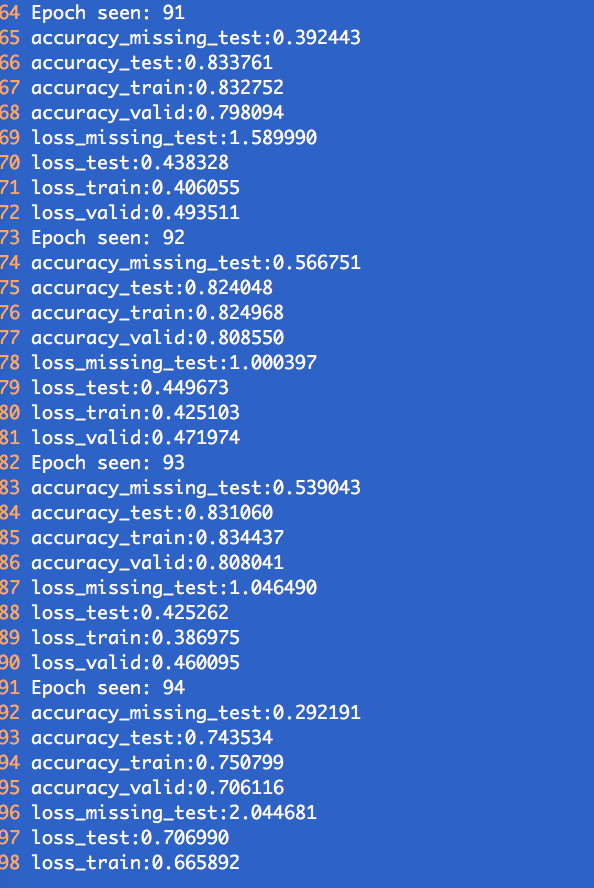
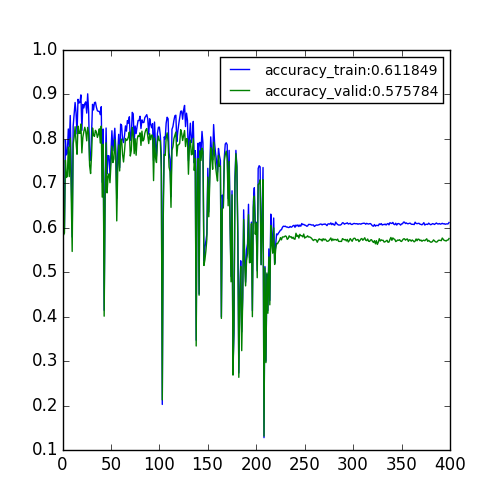
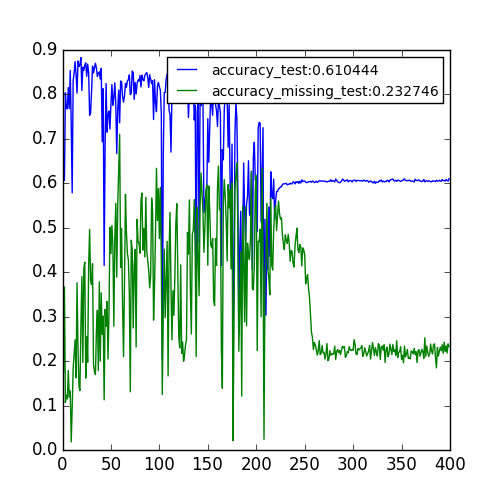
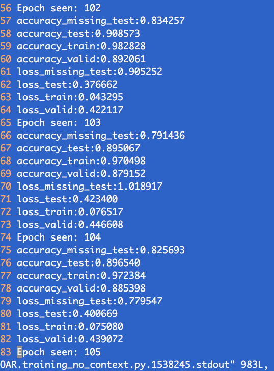
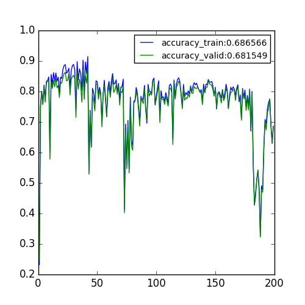
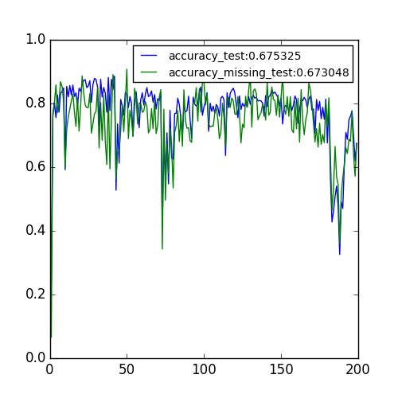

# Record for Classification Project

## 1. Analysis of Training Classification Model with Emotion Embedding

### Phenomenon: The trainig process is very unstable.

### 1. Expr1: RNN classifier with a 3-dimensional embedding of emotion.
missing pairs:{"Simple Walk","Panic Fear"},{"Sitting Down","Sadness"},{"Move Books","Joy"} 
Dataset: Emilya Dataset 
Training Set: 60% of Emilya Dataset and remove the missing paris. 
Validation Set: 20% Emilya Dataset 
Test Set: 20% of Emilya Dataset, missing paris are removed 
missing_test: The missing pairs removed during constructing Test Set 

#### a. accuracy curve(x-axis: epochs, y-axis: accuracy(range: 0 - 1.))

#### b. accuracy on test set and missing-pairs set.

### 2. Expr2:RNN classifier without any emotion input
The remaining setting is same with Expr1.  
It's very easy to reach a high accuracy for both training set , validation set, test set ,missing pairs set.

See this figure:

#### a. accuracy curve(x-axis: epochs, y-axis: accuracy(range: 0 - 1.))

#### b. accuracy on test set and missing-pairs set.

### explanation:
At the early stage of training process, the emotion embeddings have not been learned well. Some very different emotions may be close with each other in the embedding space, while the embeedings of some emotions which are similar essentially may be far away with each other. This makes the classification model tends to overfit for each emotion. So in the early stage, when update the the embedding of emotions, the beheviour of the model might change dramatically. Thus, the instantaneous performance of classification can decrease dramatically as seen in the above image. 

For addressing this problem, I am thinking about some methods. One of possible way is like this: 
Assume we have a training set $X={X_1,X_2}$, where $X_1$ is the subset where all the sequences are labeled by emotions, while $X_2$ is the one where the sequences are not labeled by emotions.
Before each epoch of training process, we randomly assign emotion labels to $X_2$ and then use $X$ train the models. 

Thierry: Do you have any ideas?

