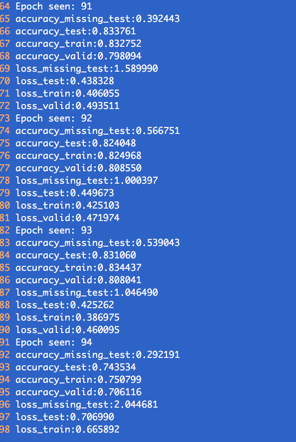

# Record for Classification Project

## 1. Grid Search For Classification
### table

This is a table:

lr|[100,20,20],dim_embd=3|[100,50,50],dim_embd=2|[100,20,20],dim_embd=3|[100,50,50],dim_embd=3
-------------|-----------------|----------------------| ---------------------|----------------------
lr=0.01      |85.084%| 75.747%| 79.55%| 76.835%
lr = 0.005   |88.114%| 77.811%|86.976%| 76.839% 
lr = 0.001   |87.096%|83.409%|88.85%|88.484%
lr = 0.0005  |87.531%|87.827%|87.383%|87.568%

## 2. Analysis of Training Classification Model with Emotion Embedding

### Phenomenon: The trainig process is very unstable.
For example, here is a screenshot:



### explanation:
At the early stage of training process, the emotion embeddings have not been learned well. Some very different emotions may be close with each other in the embedding space, while the embeedings of some emotions which are similar essentially may be far away with each other. This makes the classification model tends to overfit for each emotion. So in the early stage, when update the the embedding of emotions, it the beheviour might change dramatically. Thus, the instantaneous performance of classification can decrease dramatically as seen in the above image. 

In order to stable the learning process and accelerate the covergence speed, there is one possible strategy as following:

Assume we have a training set , where  is the subset where all the sequences are labeled by emotions, while  is the one where the sequences are not labeled by emotions.


```
Algorithm:
For each batch:
	
```


